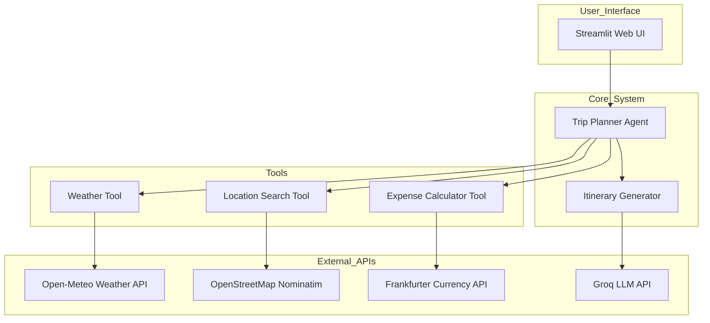

# AI Trip Planner Agent - Specification Document

## 1. Project Overview

**Project Name:** AI Trip Planner Agent  
**Type:** Web Application (Python + Streamlit)  
**Core Functionality:** An intelligent travel planning assistant that uses real-time data and AI to create comprehensive trip itineraries with weather forecasts, location recommendations, and expense calculations.  
**Target Users:** Travelers who want quick, AI-assisted trip planning without paid subscriptions

---

## 2. Technology Stack

| Component           | Technology              | Reason                                 |
| ------------------- | ----------------------- | -------------------------------------- |
| Frontend            | Streamlit               | Fast web UI development, Python-native |
| Backend             | Python 3.10+            | Core logic and API calls               |
| Weather API         | Open-Meteo              | Free, no API key required              |
| Location Search     | OpenStreetMap Nominatim | Free, no API key required              |
| Currency Conversion | frankfurter.app         | Free, no API key required              |
| AI/LLM              | Groq API (free tier)    | Fast inference, generous free tier     |

---

## 3. Architecture Design

### 3.1 System Components



### 3.2 Tool Specifications

#### Weather Tool

- **API:** Open-Meteo (https://open-meteo.com/)
- **Endpoint:** `https://api.open-meteo.com/v1/forecast`
- **Parameters:** latitude, longitude, daily forecast, timezone
- **Output:** Temperature, weather conditions, precipitation chance

#### Location Search Tool

- **API:** OpenStreetMap Nominatim (https://nominatim.openstreetmap.org/)
- **Endpoint:** `https://nominatim.openstreetmap.org/search`
- **Parameters:** query, format=json, limit results
- **Output:** Location name, latitude, longitude, type

#### Expense Calculator

- **API:** Frankfurter (https://www.frankfurter.app/)
- **Endpoint:** `https://api.frankfurter.app/latest`
- **Parameters:** from currency, to currency
- **Output:** Exchange rates, converted amounts

#### Itinerary Generator

- **AI:** Groq API with Llama-3.1 model
- **Input:** Destination, dates, preferences, weather data, budget
- **Output:** Day-by-day itinerary with activities and estimated costs

---

## 4. Feature List

### 4.1 Core Features

1. **Destination Search**
   - Search for cities/locations using natural language
   - Display search results with coordinates
   - Auto-select destination for planning

2. **Weather Forecasting**
   - Fetch 7-day weather forecast for destination
   - Display temperature, conditions, precipitation
   - Show weather icons for visual representation

3. **Budget & Expense Calculator**
   - Support multiple currencies (USD, EUR, GBP, JPY, etc.)
   - Convert between currencies using real-time rates
   - Estimate trip costs based on daily budget

4. **AI Itinerary Generation**
   - Generate day-by-day travel itinerary
   - Consider weather conditions for activities
   - Include estimated expenses per day
   - Provide activity recommendations

5. **Trip Summary Dashboard**
   - Overview of entire trip
   - Total estimated cost
   - Weather summary
   - Key highlights

### 4.2 User Interactions

1. User enters trip destination (e.g., "Tokyo, Japan")
2. System searches and displays location options
3. User selects destination and enters travel dates
4. System fetches weather forecast for those dates
5. User sets budget and preferred currency
6. System generates comprehensive itinerary using AI
7. User can regenerate or modify itinerary

---

## 5. Data Models

### 5.1 Trip Request

```python
{
    "destination": str,
    "start_date": date,
    "end_date": date,
    "budget": float,
    "currency": str,
    "travelers": int,
    "preferences": list[str]
}
```

### 5.2 Weather Data

```python
{
    "date": str,
    "temperature_max": float,
    "temperature_min": float,
    "weather_code": int,
    "precipitation_probability": int
}
```

### 5.3 Location Data

```python
{
    "name": str,
    "lat": float,
    "lon": float,
    "type": str,
    "country": str
}
```

### 5.4 Itinerary Day

```python
{
    "day": int,
    "date": str,
    "activities": list[Activity],
    "weather": str,
    "estimated_cost": float
}
```

---

## 6. UI/UX Design

### 6.1 Layout Structure

```
┌─────────────────────────────────────────────────┐
│              AI Trip Planner Agent              │
├─────────────────────────────────────────────────┤
│  ┌─────────────┐  ┌─────────────────────────┐   │
│  │  Sidebar    │  │     Main Content        │   │
│  │             │  │                         │   │
│  │ - Dest.     │  │  [Search Destination]   │   │
│  │ - Dates     │  │                         │   │
│  │ - Budget    │  │  [Weather Display]      │   │
│  │ - Currency  │  │                         │   │
│  │             │  │  [Itinerary Results]    │   │
│  │ [Generate]  │  │                         │   │
│  └─────────────┘  └─────────────────────────┘   │
└─────────────────────────────────────────────────┘
```

### 6.2 Color Scheme

- **Primary:** Deep Blue (#1E3A5F) - Trust and reliability
- **Secondary:** Coral (#FF6B6B) - Energy and excitement
- **Accent:** Teal (#4ECDC4) - Freshness and travel
- **Background:** Light Gray (#F8F9FA) - Clean and modern

### 6.3 Typography

- **Headings:** Roboto Bold
- **Body:** Roboto Regular
- **Monospace:** Roboto Mono (for costs/numbers)

---

## 7. Implementation Notes

### 7.1 API Rate Limiting Compliance

- Nominatim: Max 1 request/second, include User-Agent
- Open-Meteo: No strict limits, reasonable usage
- Frankfurter: No limits, free service
- Groq: Free tier with reasonable limits

### 7.2 Error Handling

- Graceful degradation if any API fails
- Clear error messages to users
- Retry logic for transient failures

### 7.3 Caching Strategy

- Cache weather data for 1 hour
- Cache exchange rates for 24 hours
- Cache location search results

---

## 8. File Structure

```
ai-trip-planner/
├── app.py                 # Main Streamlit application
├── requirements.txt       # Python dependencies
├── config.py             # Configuration settings
├── tools/
│   ├── __init__.py
│   ├── weather.py        # Weather API tool
│   ├── locations.py      # Location search tool
│   ├── expenses.py       # Currency conversion tool
│   └── itinerary.py      # AI itinerary generator
├── utils/
│   ├── __init__.py
│   └── helpers.py        # Helper functions
├── templates/
│   └── page_config.py    # Streamlit page config
└── .env.example          # Environment variables template
```

---

## 9. Acceptance Criteria

### 9.1 Functional Requirements

- [ ] User can search for any destination worldwide
- [ ] Weather forecast displays for selected dates
- [ ] Currency conversion works for major currencies
- [ ] AI generates coherent day-by-day itinerary
- [ ] Total trip cost is calculated accurately

### 9.2 Non-Functional Requirements

- [ ] No paid API keys required
- [ ] All external APIs accessible without login
- [ ] Response time < 5 seconds for most operations
- [ ] Clean, intuitive user interface

### 9.3 Success Conditions

1. Complete trip can be planned in under 60 seconds
2. All four tools (weather, location, expenses, itinerary) work correctly
3. No authentication barriers for users
4. Professional-looking output that rivals paid services
